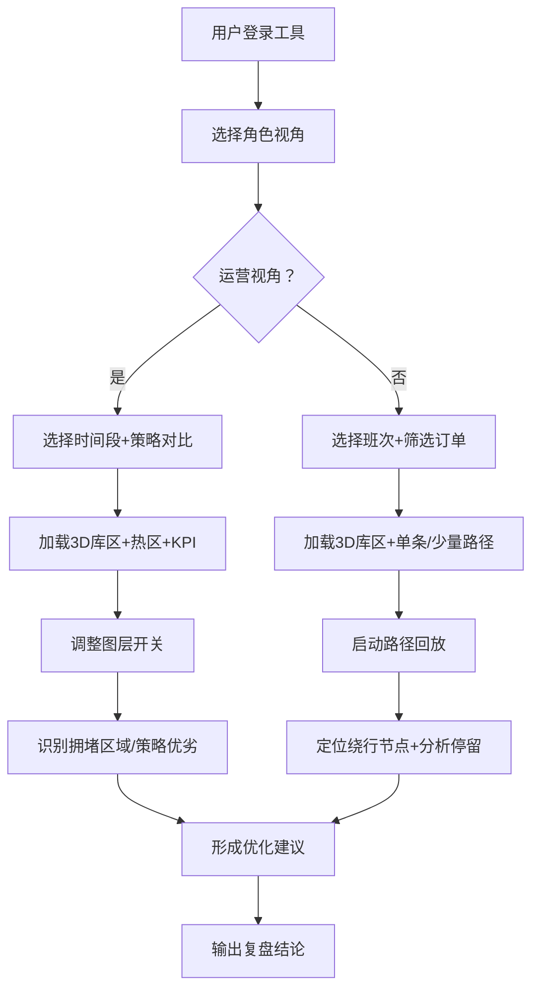

## 1. 产品概述

面向仓储运营团队的3D空间可视化分析工具，将库区三维结构、拣货任务轨迹和区域热度数据进行融合呈现，支持运营人员和现场主管进行多维度复盘分析。

- 核心价值：通过三维空间视角还原仓储作业现场，让运营决策和现场管理从"凭经验"转向"看数据"
- 目标用户：仓储运营分析师、仓库现场主管、拣货策略优化人员
- 解决问题：传统二维热力图无法表达立体拥堵、路径回放缺乏空间参照、策略对比缺少直观视觉支撑

## 2. 核心功能

### 2.1 用户角色

| 角色 | 核心关注点 | 典型使用场景 |
|------|------------|--------------|
| 运营人员 | 整体效率、吞吐瓶颈、拥堵区域、策略对比 | 日/周复盘会议，筛选时间段看整体热度，对比不同拣货策略的路径效率 |
| 现场主管 | 班次表现、单任务路径、绕行原因、人员分布 | 交接班后追踪异常订单，回放某拣货员的完整路径，分析为何绕路 |

### 2.2 功能模块

1. **主视图页（3D场景）**：库区立体结构渲染、路径动态叠加、热区颜色映射、视角控制
2. **顶部筛选栏**：时间段选择器、班次切换、拣货策略下拉、数据刷新
3. **左侧控制面板**：图层开关（库区/货架/路径/热区）、路径回放控制（播放/暂停/倍速/进度条）、视角预设
4. **右侧统计面板**：KPI指标卡片（总任务数、平均路径长度、平均耗时、拥堵指数）、Top5拥堵区域列表、策略对比柱状图
5. **底部详情抽屉**：单任务详情展开（订单信息、路径节点序列、停留时间分析）、区域点击详情

### 2.3 页面详情

| 页面名称 | 模块名称 | 功能描述 |
|----------|----------|----------|
| 主视图页 | 3D库区场景 | 多层货架立体渲染，支持鼠标拖拽旋转、滚轮缩放、右键平移；货架按区域分组着色 |
| 主视图页 | 任务路径图层 | 半透明管状路径叠加，支持单条高亮、多条批量显示；路径起点（绿色）/终点（红色）/中转点（黄色）标记 |
| 主视图页 | 热区叠加图层 | 基于网格密度的热度颜色映射（蓝→绿→黄→红），支持透明度调节，可贴地/立体两种显示模式 |
| 主视图页 | 路径回放引擎 | 可拖动进度条，支持0.5x/1x/2x/4x倍速，播放时小人图标沿路径移动，节点处显示停留气泡 |
| 顶部筛选栏 | 时间段筛选 | 日期选择 + 时间滑块（精确到15分钟粒度），快捷预设：今日早班/今日中班/今日晚班/昨日全天/本周 |
| 顶部筛选栏 | 策略对比选择器 | 支持选择2-3种拣货策略进行并列对比（S型/分区接力/波浪拣货），路径分色显示 |
| 左侧控制面板 | 图层管理器 | 库区结构、货架编号、任务路径、热度网格、人员位置，各自独立开关 |
| 左侧控制面板 | 回放控制条 | 播放/暂停、前进/后退10秒、倍速切换、进度拖拽、当前时间显示 |
| 右侧统计面板 | KPI概览卡片 | 4张指标卡：完成任务数、平均行走距离（米）、平均拣货耗时（分钟）、拥堵指数（0-100），环比趋势箭头 |
| 右侧统计面板 | Top拥堵区域 | 列表显示前5个最拥堵货架区，含经过次数、平均停留时长、建议优化方向 |
| 右侧统计面板 | 策略对比图 | 分组柱状图，对比不同策略在平均路径长度、耗时、回头率三个维度的表现 |
| 底部抽屉 | 任务详情 | 点击单条路径后展开：订单号、SKU数量、拣货员、开始/结束时间、路径节点序列表（含每个货位停留时间） |

## 3. 核心流程

### 3.1 运营人员日常复盘流程

运营人员打开工具 → 选择"本周"时间段 → 查看整体KPI和拥堵指数 → 切换热度图层定位Top3红区 → 选择S型与波浪两种策略对比 → 观察路径差异 → 导出结论

### 3.2 现场主管异常追溯流程

现场主管进入工具 → 选择"今日中班" → 筛选某异常订单号 → 单条路径高亮 → 开启回放（0.5倍速）→ 观察绕行点 → 查看节点停留时间 → 判断是货位摆放问题还是人员操作问题

## 4. 用户界面设计

### 4.1 设计风格

- **风格定位**：工业科技风 / 深色数据驾驶舱，契合内部分析工具属性，强调信息密度和专业感
- **主色调**：深空蓝 (#0A1628) 背景 + 冷钢蓝 (#1E3A5F) 面板 + 科技青 (#00D4FF) 主强调
- **辅助色**：路径绿 (#00FF94) / 警示红 (#FF4D6D) / 热区黄 (#FFC93C) / 对比紫 (#B794F4)
- **字体方案**：标题使用 JetBrains Mono（等宽数字对齐），正文使用 Inter，两者均为现代无衬线，数字渲染清晰
- **容器风格**：面板采用毛玻璃背景 (backdrop-blur) + 1px 高亮描边 + 内阴影，营造悬浮科技感
- **交互细节**：hover时面板边框发光，图表数字带滚动入场动画，3D场景转场带淡入

### 4.2 页面设计概览

| 页面名称 | 模块名称 | UI元素与交互 |
|----------|----------|--------------|
| 主视图页 | 3D场景区 | 占屏幕中央70%区域，深色渐变背景配微弱星点，场景带环境光+方向光+点光源组合，物体选中时边缘高亮描边 |
| 主视图页 | 顶部筛选栏 | 48px高度通栏，左侧Logo+标题，中间筛选组件横向排列，右侧用户头像；每个筛选器为胶囊形状 |
| 主视图页 | 左侧控制栏 | 280px宽折叠面板，分图层控制、回放控制两个分区；分区标题带下划线装饰，开关为定制滑动样式 |
| 主视图页 | 右侧统计栏 | 320px宽面板，KPI卡片2x2网格，卡片底部带微折线趋势；图表带渐变填充和圆角 |
| 主视图页 | 底部抽屉 | 默认收起，高度56px的横条（显示当前选中任务摘要）；展开后高度300px，左右分栏：左侧节点时间轴，右侧信息表 |

### 4.3 响应式设计

- 桌面优先设计，最低支持 1440x900 分辨率
- 宽度小于 1280px 时，右侧面板自动折叠为图标侧栏，hover展开
- 不考虑移动端，本工具为桌面端内部运营系统

### 4.4 3D场景指导

- **环境氛围**：深空蓝渐变背景 + 轻微雾效 (FogExp2)，远处货架自然淡出，营造纵深
- **光照设置**：AmbientLight(0xffffff, 0.4) 基础光 + DirectionalLight(0x88aaff, 0.8) 主光（带阴影）+ 3盏PointLight分别放置于库区上方，突出货架金属质感
- **摄像机**：初始采用45°俯视透视视角，fov=50，near=0.1，far=1000；支持OrbitControls，禁用翻滚，限制垂直角度20°-85°
- **组成元素**：
  - 地面：带网格纹理的发光平面，网格线为科技青色
  - 货架：箱体几何体，顶面半透明发光，侧面深灰金属材质，边缘高亮线框
  - 路径：TubeGeometry + 发光材质（MeshBasicMaterial + 半透明 + additive blending）
  - 热区：InstancedMesh 渲染大量立方体或平面，按热度值映射颜色 + 高度
  - 拣货员：低多边形胶囊体 + 发光头顶标记
- **后处理**：Bloom泛光（阈值0.8，强度0.6）+ FXAA抗锯齿，突出光管和热区辉光
- **性能策略**：路径超过50条时自动降采样，热区网格根据距离做LOD切换，总面数控制在50万以内
