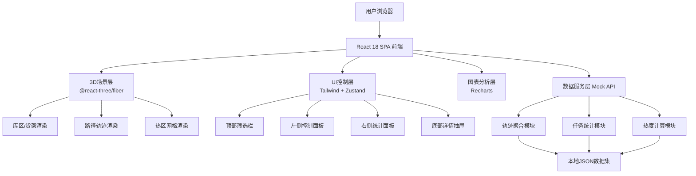
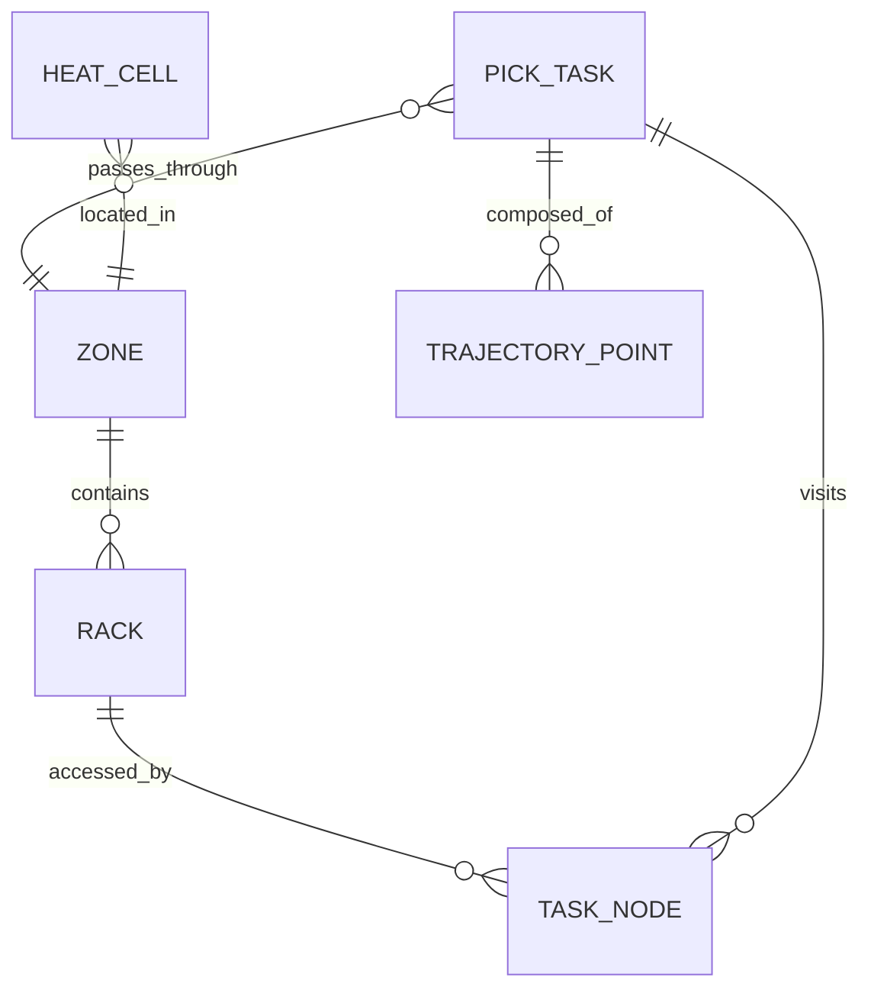

## 1. 架构设计

采用前后端分离的单页应用架构，前端承担全部空间可视化、交互回放和图表渲染职责；后端/数据层以Mock形式内置，提供轨迹聚合和任务统计数据接口，便于后续对接真实WMS系统。



## 2. 技术描述

- **前端框架**：React 18 + TypeScript 5 + Vite 5
- **初始化工具**：vite-init（react-ts模板）
- **状态管理**：Zustand 4 — 轻量、无需Provider包裹，适合3D场景频繁状态更新
- **3D引擎**：Three.js r160 + @react-three/fiber 8 + @react-three/drei 9 + @react-three/postprocessing 2
- **UI组件**：原生TailwindCSS 3 自定义样式组件，避免引入重组件库，保持科技风格控
- **图表库**：Recharts 2 — 轻量、React原生、支持渐变填充，与Zustand无缝
- **图标库**：lucide-react
- **路径工具**：three.js内置CatmullRomCurve3生成平滑路径 + TubeGeometry生成管道
- **后端/数据层**：前端内置Mock Service（纯TypeScript函数 + JSON数据），提供统一Promise API，后续可无缝替换为真实HTTP请求
- **数据持久化**：无数据库，所有数据为内置Mock，用户筛选状态存入localStorage

## 3. 路由定义

单页应用仅一个主视图，通过组件分区而非路由切换实现多面板布局。

| 路由 | 用途 |
|------|------|
| / | 主视图页（3D场景 + 所有控制面板集成）|

## 4. 数据服务层 API 定义（Mock）

所有接口统一返回Promise，类型定义如下：

```typescript
// 时间范围查询参数
interface TimeRangeParams {
  startTime: string;      // ISO 8601
  endTime: string;
  shift?: 'morning' | 'afternoon' | 'night' | 'all';
  strategies?: StrategyType[];  // 拣货策略过滤
}

type StrategyType = 'S_SHAPED' | 'ZONED_RELAY' | 'WAVE_PICKING' | 'ALL';

// 库区结构数据
interface WarehouseStructure {
  zones: Zone[];
  racks: Rack[];
  aisles: Aisle[];
  groundSize: { width: number; depth: number };
}

interface Zone {
  id: string;
  name: string;
  color: string;
  bounds: { x: number; z: number; w: number; d: number };
}

interface Rack {
  id: string;
  zoneId: string;
  position: { x: number; y: number; z: number };
  size: { w: number; h: number; d: number };
  levels: number;       // 层数
  slotsPerLevel: number;
}

interface Aisle {
  id: string;
  from: { x: number; z: number };
  to: { x: number; z: number };
  width: number;
}

// 任务轨迹
interface PickTask {
  taskId: string;
  orderNo: string;
  pickerId: string;
  pickerName: string;
  strategy: StrategyType;
  shift: 'morning' | 'afternoon' | 'night';
  startTime: string;
  endTime: string;
  totalDistance: number;     // 米
  totalDuration: number;     // 秒
  skuCount: number;
  points: TrajectoryPoint[];
  nodes: TaskNode[];
}

interface TrajectoryPoint {
  t: number;           // 相对起始偏移秒数
  x: number;
  y: number;
  z: number;
}

interface TaskNode {
  nodeId: string;
  rackId: string;
  slotCode: string;     // 货位编码 A-01-03-05
  arriveAt: number;     // 相对偏移秒
  leaveAt: number;
  dwellTime: number;    // 停留秒
  skuQty: number;
}

// 统计KPI
interface KPIData {
  totalTasks: number;
  avgDistance: number;
  avgDuration: number;
  congestionIndex: number;  // 0-100
  comparePrevious: {
    totalTasks: number;     // 环比%
    avgDistance: number;
    avgDuration: number;
    congestionIndex: number;
  };
}

// 拥堵区域
interface CongestionZone {
  zoneId: string;
  zoneName: string;
  passCount: number;
  avgDwellTime: number;    // 秒
  suggestion: string;
}

// 策略对比
interface StrategyCompare {
  strategy: StrategyType;
  taskCount: number;
  avgDistance: number;
  avgDuration: number;
  revisitRate: number;     // 回头率%
}

// 热区网格
interface HeatGrid {
  cellSize: number;
  cols: number;
  rows: number;
  cells: HeatCell[];
}

interface HeatCell {
  col: number;
  row: number;
  value: number;          // 热度值 0-1
  passCount: number;
  totalDwell: number;
}

// === API 接口定义 ===
interface WarehouseAPI {
  getStructure(): Promise<WarehouseStructure>;
  getTasks(params: TimeRangeParams): Promise<PickTask[]>;
  getKPIs(params: TimeRangeParams): Promise<KPIData>;
  getCongestionZones(params: TimeRangeParams, topN?: number): Promise<CongestionZone[]>;
  getStrategyCompare(params: TimeRangeParams): Promise<StrategyCompare[]>;
  getHeatGrid(params: TimeRangeParams, cellSize?: number): Promise<HeatGrid>;
}
```

## 5. 前端模块划分（Zustand Store）

```typescript
// store/useAppStore.ts
interface AppState {
  // 筛选条件
  timeRange: { start: string; end: string };
  shift: 'all' | 'morning' | 'afternoon' | 'night';
  selectedStrategies: StrategyType[];
  
  // 图层开关
  layers: {
    warehouse: boolean;
    rackLabels: boolean;
    paths: boolean;
    heat: boolean;
    pickers: boolean;
  };
  heatOpacity: number;
  heatMode: 'planar' | 'volumetric';
  
  // 回放状态
  isPlaying: boolean;
  playbackSpeed: 0.5 | 1 | 2 | 4;
  playbackProgress: number;   // 0-1
  selectedTaskId: string | null;
  highlightedTaskIds: string[];
  
  // 加载数据
  structure: WarehouseStructure | null;
  tasks: PickTask[];
  kpis: KPIData | null;
  congestionZones: CongestionZone[];
  strategyCompare: StrategyCompare[];
  heatGrid: HeatGrid | null;
  loading: boolean;
  
  // Actions
  setTimeRange(start: string, end: string): void;
  toggleLayer(key: keyof AppState['layers']): void;
  setPlaybackSpeed(s: 0.5 | 1 | 2 | 4): void;
  togglePlay(): void;
  selectTask(id: string | null): void;
  fetchData(): Promise<void>;    // 依据筛选条件重拉全部数据
}
```

## 6. 数据模型（Mock数据结构描述）

### 6.1 实体关系



### 6.2 Mock数据生成规则

- **库区结构**：20m x 30m 地面，划分A/B/C/D四个区，每区5-7排货架，每货架4层，每层6货位
- **货架位置**：沿X方向等距排列，通道宽2m
- **任务数据**：生成200条PickTask，覆盖3种策略（S型占40%，分区接力35%，波浪25%），早中晚班次均匀分布
- **轨迹点**：每条任务生成80-200个轨迹点，沿通道中心线+货位偏移组合，加入少量随机抖动
- **热度值**：基于所有轨迹点的二维直方图统计，归一化至0-1，通道交汇处、拣货密集区自动呈现高值
- **KPI环比**：当前时段对比上一同时段（如本周对比上周同时间段），生成±15%以内的波动
- **策略对比**：S型距离最短但回头率高，波浪拣货回头率低但距离长，分区接力介于两者之间

### 6.3 核心算法

1. **路径平滑算法**：原始离散轨迹点 → CatmullRomCurve3插值 → 生成50段细分曲线 → TubeGeometry构造发光管道
2. **热度网格算法**：二维网格(1m cell) → 每条轨迹点落入cell累计值 + 停留时间加权 → 高斯模糊平滑 → min-max归一化
3. **回放进度计算**：`progress` (0-1) × 任务总时长 → 查找所在轨迹段 → 线性插值得到小人坐标 → 同步更新时间戳显示
4. **拥堵指数计算**：`congestionIndex = Σ(zone_passCount × zone_avgDwell) / max_possible` 归一化至0-100
